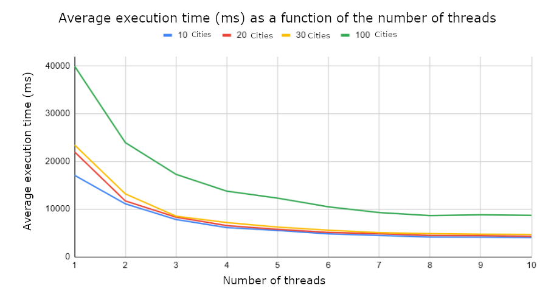

# Traveling Salesman Problem resolution

## Description

This is a solution to the traveling salesman problem using an ant colony optimization algorithm and We use multithreading to accelerate the execution of the algorithm.

## Results

To assess the efficiency of multithreading on ant colony algorithms, we measured the execution times based on the number of threads and the number of cities.

The tests were conducted on an Intel Core i5-9300HF CPU @ 2.40GHz processor (CPUs) with 8GB of RAM.

For each number of cities, we measured the execution time (in ms) using 1 to 10 threads. The displayed results represent averages obtained from multiple program iterations.

Compared to using 1 thread, we observed a reduction in execution time ranging from 35% to 45% with 2 threads, and from 75% to 80% with 8 threads.

Therefore, the performance gain is more significant when transitioning from single-threading to multithreading, and it converges starting from 8 threads. As mentioned before, this behavior is related to the configuration of the test computer.

## Contributors :

- Julian BERTHOMIER
- Alexis ROVILLE
- Aymerick SERGEANT